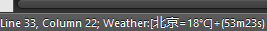

SublimeWeather
=============

This is the plugin which achieve the function of GetWeather .
Test under version 3 of sublime (3126).
You can see the effect picture below .

How to use

1.get from github  
$cd $(SublimeText)\Data\Packages  
$git clone https://github.com/wdxzkp/SublimeWeather  
or download zip
put the file "SublimeWeather" in Preferens-Brows Packages(SublimeText\Data\Packages)  
2.open SublimeText  
3."alt+shift+t": start fetch weather data per 30s  
4."alt+shift+s": pause loop  
5."alt+shift+z": make counter zero  

